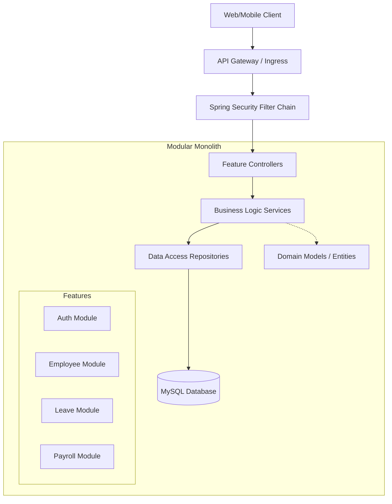
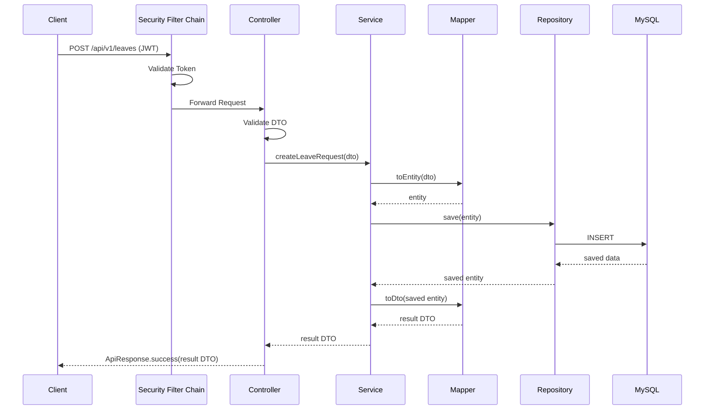
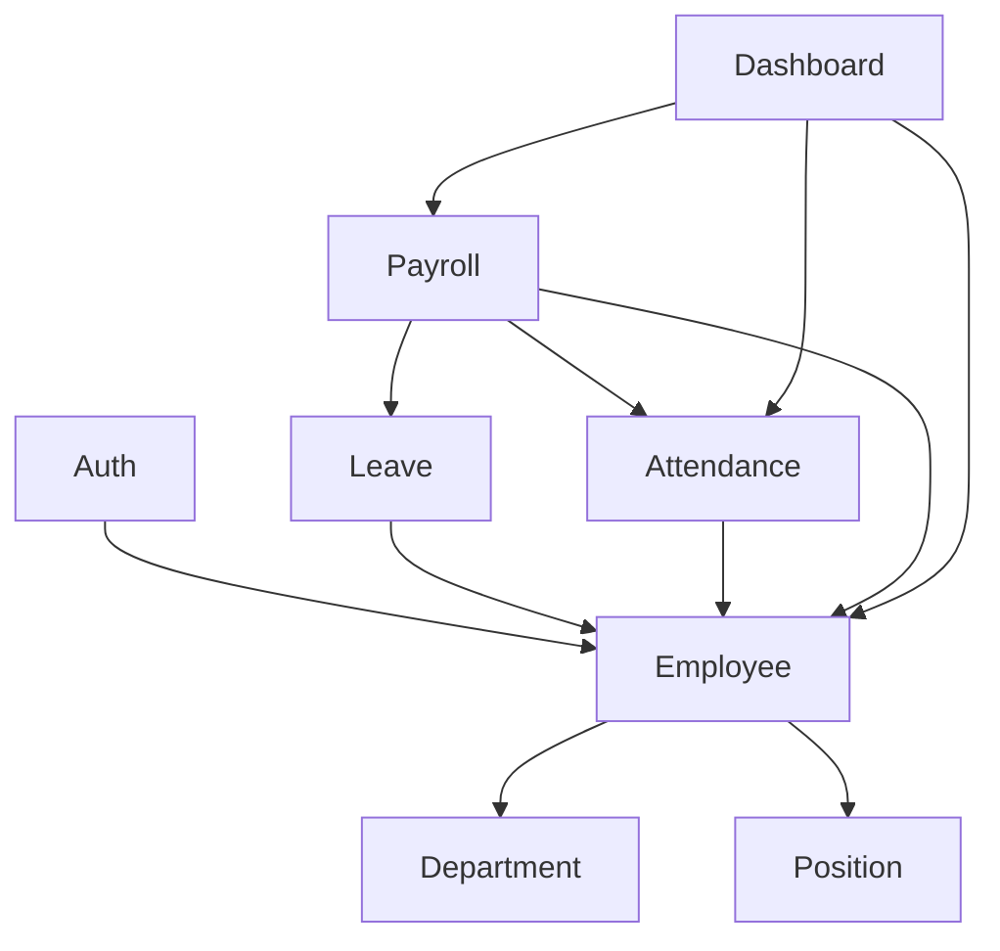

# HRMS Architecture Overview

## 1. Architectural Style

The HR Management System (HRMS) follows a **Modular Monolith** architecture with a **Package-by-Feature** organization strategy. It incorporates principles from **Clean Architecture** to ensure separation of concerns and testability.

### High-Level Architecture Diagram


## 2. Package-by-Feature Organization

Instead of organizing by technical layers (e.g., all controllers in one package, all services in another), HRMS is organized by business capabilities.

### Package Tree
```text
com.ng_doanh.hr_management_system/
├── auth/
│   ├── controller/, service/, repository/, dto/, entity/, mapper/
├── employee/
│   ├── controller/, service/, repository/, dto/, entity/, mapper/
├── department/
├── position/
├── attendance/
├── leave/
├── payroll/
├── dashboard/
└── common/
    ├── config/       (Swagger, WebMvc, etc.)
    ├── security/     (JWT filters, Auth entry points)
    ├── exception/    (GlobalExceptionHandler, ErrorCode)
    ├── audit/        (JPA Auditing components)
    ├── validation/   (Custom validators)
    └── utils/        (DateUtils, SecurityUtils)
```

**Benefits:**
- **High Cohesion:** Everything related to a feature is in one place.
- **Microservices Readiness:** Easier to extract a feature into a microservice later.
- **Clear Boundaries:** Limits unintended dependencies between modules.

## 3. Layer Responsibilities

Within each feature package, the standard 3-tier architecture applies:

1.  **Controller Layer (`@RestController`):**
    - Handles HTTP requests and responses.
    - Input validation (using `@Valid`).
    - Wraps responses in standard `ApiResponse<T>`.
    - *Rule:* Controllers must never contain business logic.
2.  **Service Layer (`@Service`):**
    - Contains core business rules.
    - Orchestrates data fetching and saving.
    - Handles transaction management (`@Transactional`).
    - *Rule:* Services map Entities to DTOs before returning to Controllers.
3.  **Repository Layer (`@Repository`):**
    - Spring Data JPA interfaces.
    - Custom JPQL/Native queries.
    - *Rule:* Repositories only return Entities or Projections.

## 4. Cross-Cutting Concerns

- **Security:** Spring Security with JWT stateless authentication. Intercepts requests, validates tokens, and establishes the `SecurityContext`. Role-based access control (RBAC) via method-level security (`@PreAuthorize`).
- **Exception Handling:** `@RestControllerAdvice` intercepts all unhandled exceptions. Uses a central `ErrorCode` enum to map exceptions to standard HTTP statuses and internal codes, returning a consistent `ApiResponse`.
- **Validation:** Standard Jakarta Bean Validation (Hibernate Validator) applied at the DTO level.
- **Audit:** Spring Data JPA `@EnableJpaAuditing` automatically populates `createdAt`, `updatedAt`, `createdBy`, and `updatedBy` fields on base entities.

## 5. Request / Response Flow



## 6. Dependency Rules

1. **Top-Down Dependency:** Controllers depend on Services, Services depend on Repositories. Upward dependencies are forbidden.
2. **DTO Isolation:** DTOs are defined as Java 14+ `record`s. Entities must never be leaked to the presentation layer. MapStruct is used for conversion.
3. **Constructor Injection:** Field injection (`@Autowired`) is strictly prohibited. Use constructor injection (often via Lombok's `@RequiredArgsConstructor`) to ensure immutability and testability.

### Module Dependency Diagram


## 7. Version Evolution Strategy (V1 → V2 → V3)

### Version 1 (Current)
- Monolithic deployment.
- MySQL handles all data storage (Relational data + Refresh Tokens).
- Synchronous processing.

### Version 2 (Performance & Scale)
- **Redis Integration:**
  - Refresh tokens migrate from MySQL to Redis with TTL.
  - Caching layer added for frequently accessed, rarely changed data (Departments, Positions).
- **Migration Strategy (No API changes):**
  - We define a `TokenRepository` interface. In V1, it's implemented by `JpaTokenRepository`. In V2, we switch to `RedisTokenRepository` seamlessly via Spring profiles or `@ConditionalOnProperty`.

### Version 3 (Asynchronous & Advanced Features)
- **Message Broker / Scheduler:** Quartz or Spring `@Scheduled` for background tasks (Payroll generation).
- **Email/Notifications:** Asynchronous event listeners (`@Async`) for leave approvals.
- **File Processing:** S3 or local disk for Excel/PDF exports and user avatars.

## 8. Design Patterns Utilized

- **Strategy / Rule Engine:** Used in Payroll calculation. Different salary components (base, tax, deductions) are evaluated based on database-driven rules rather than hardcoded logic.
- **Builder:** Provided by Lombok `@Builder` for constructing complex Entities and DTOs.
- **Factory:** Used in exception handling to create specific `AppException` instances from the `ErrorCode` enum.
- **Template Method:** Used in base abstract classes (e.g., standard CRUD services) where the skeleton is defined, and specific modules override details.

## 9. Technology Decisions & Rationale

| Technology | Rationale |
| :--- | :--- |
| **Java 21** | Virtual Threads (Project Loom) readiness, Pattern Matching, Records for immutable DTOs. |
| **Spring Boot 4.1.0** | Latest enterprise standards, optimized startup, built-in observability. |
| **MySQL 8** | ACID compliance, JSON column support, proven reliability for HR/Payroll data. |
| **MapStruct** | Compile-time code generation for mapping is significantly faster and safer than reflection-based mappers (e.g., ModelMapper). |
| **Flyway** | Version control for database schema. Ensures consistent DB state across environments. |
| **Constructor Injection** | Ensures dependencies are not null, making classes easier to unit test without Spring context. |
