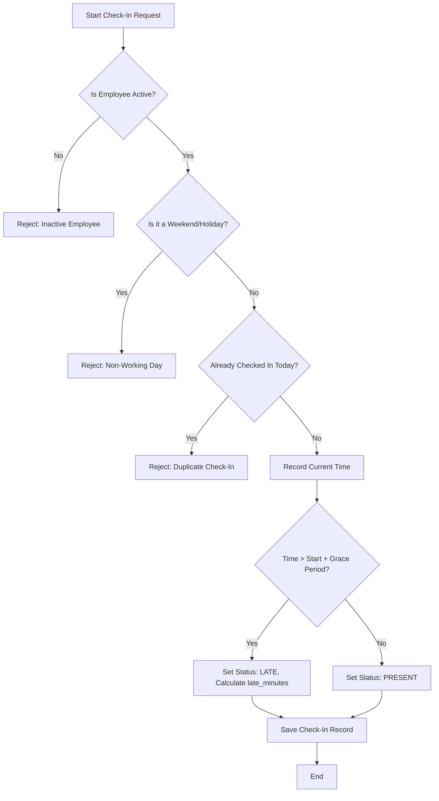
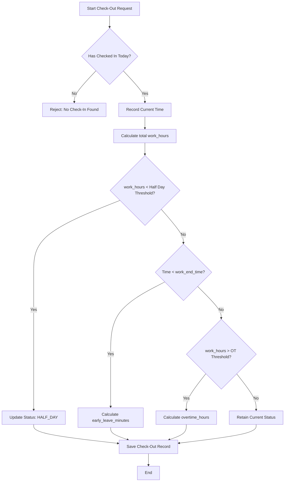
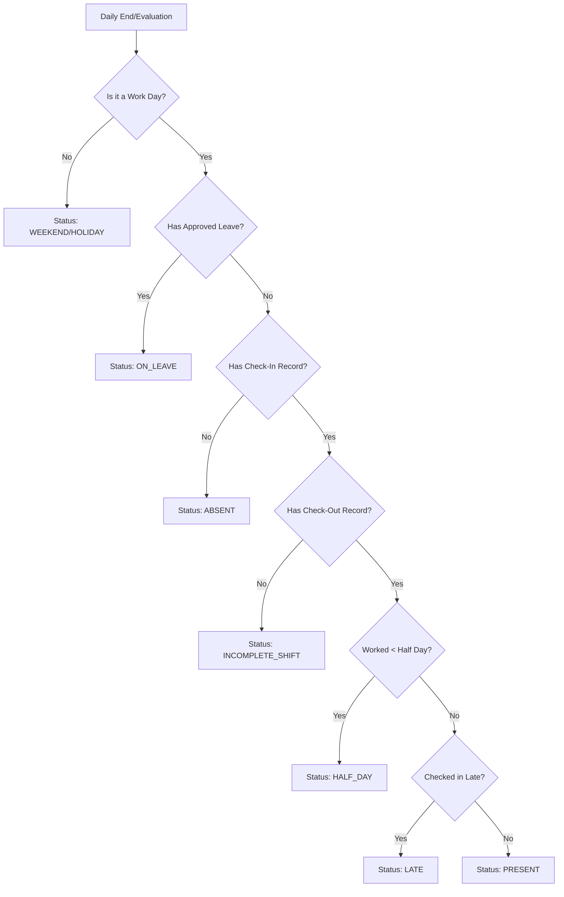
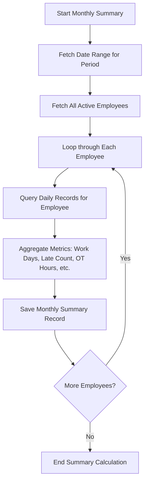

# Attendance Management Design Document

## 1. Business Rules

### 1.1 Check-In Rules
1. **Single Check-In**: An employee can only check in once per day. Subsequent check-in attempts on the same day will be rejected.
2. **Timestamp Recording**: The check-in time is recorded as the system's current time upon a successful request.
3. **Late Check-In**: If the check-in time is after `work_start_time` + `late_threshold_minutes`, the attendance status is marked as **LATE**, and the `late_minutes` are calculated.
4. **On-Time Check-In**: If the check-in time is before or exactly at `work_start_time` + `late_threshold_minutes`, the status is initialized as **PRESENT**.
5. **Employee Status**: Only employees with an **ACTIVE** status are permitted to check in.
6. **Non-Working Days**: Check-ins are not allowed on configured weekends or holidays by default.

### 1.2 Check-Out Rules
1. **Prerequisite**: An employee must have a valid check-in record for the day to check out.
2. **Timestamp Recording**: The check-out time is recorded as the system's current time.
3. **Early Leave**: If the check-out occurs before `work_end_time`, the `early_leave_minutes` are calculated.
4. **Working Hours Calculation**: `work_hours` = (`check_out_time` - `check_in_time`) minus `lunch_break_minutes` (if configured and if the shift spanned the lunch period).
5. **Half-Day Status**: If `work_hours` is less than the `half_day_threshold_hours`, the daily status is updated to **HALF_DAY**.
6. **Overtime Calculation**: If `work_hours` exceeds the `overtime_start_after_hours`, overtime is computed as: `overtime_hours` = `work_hours` - `standard_hours`. This value is capped at `max_overtime_hours`.

### 1.3 Status Determination
Daily attendance status is determined based on the following logic:
- **PRESENT**: Checked in on time, and checked out on time or later (working hours ≥ standard).
- **LATE**: Checked in after the allowed grace period.
- **HALF_DAY**: Total worked hours are less than the half-day threshold.
- **ABSENT**: No check-in record exists for a scheduled workday.
- **ON_LEAVE**: Employee has an approved leave request for the entire day.
- **HOLIDAY**: The day is a system-configured holiday.

### 1.4 Configuration Table (`attendance_config`)
The attendance system is heavily metadata-driven. All parameters are configurable:

| Key | Default Value | Description |
|-----|---------------|-------------|
| `work_start_time` | 09:00 | Standard work start time |
| `work_end_time` | 18:00 | Standard work end time |
| `late_threshold_minutes` | 15 | Grace period for late check-in |
| `half_day_threshold_hours` | 4 | Minimum work hours to qualify for half day |
| `overtime_start_after_hours` | 8 | Total hours after which overtime applies |
| `max_overtime_hours` | 4 | Maximum allowable daily overtime hours |
| `lunch_break_minutes` | 60 | Duration of the lunch break (subtracted from total) |
| `weekend_days` | SATURDAY,SUNDAY | Designated weekend days |
| `standard_work_hours` | 8 | Expected standard daily work hours |

### 1.5 Reporting
- **Daily Report**: Lists all employees along with their computed status for a specific date.
- **Monthly Report**: Aggregated summary per employee for a given month, detailing: total work days, late count, absent count, early leave count, and total overtime hours.
- **Auto-Absent Tagging**: A scheduled job (targeted for V3) will automatically mark employees as **ABSENT** if they have no check-in record by the end of a workday and no approved leave.

### 1.6 Attendance-Payroll Integration
The attendance module acts as a critical data provider for the payroll engine.
- During the monthly payroll calculation, the system queries aggregated `attendance_records` for the target payroll period.
- Key metrics extracted: `work_days`, `absent_days`, `late_count`, and `total_overtime_hours`.
- These metrics feed directly into the payroll salary rules (e.g., late penalty deductions, overtime pay allowances, and attendance bonuses).

---

## 2. Flow Diagrams

### 2.1 Check-In Process

### 2.2 Check-Out Process

### 2.3 Status Determination Logic

### 2.4 Monthly Attendance Summary Calculation

---

## 3. Edge Cases
- **Duplicate Check-In**: The system strictly rejects multiple check-in requests for the same date.
- **Missing Check-In**: A check-out attempt without a prior check-in record for the day is rejected.
- **Holiday/Weekend Attempts**: Check-ins on non-working days are rejected (can be configured to allow or warn based on business needs).
- **Retroactive Adjustments**: Standard users cannot modify past records. Administrators possess the capability to perform retroactive attendance corrections.
- **Cross-Midnight Shifts**: Currently out of scope for Version 1. Future iterations will require advanced shift management configurations.
