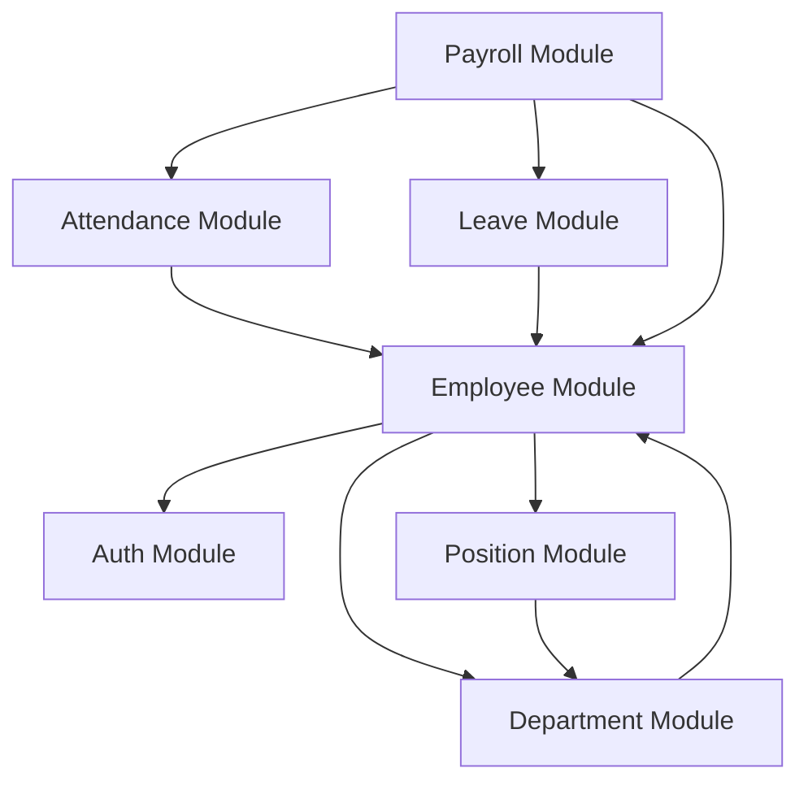
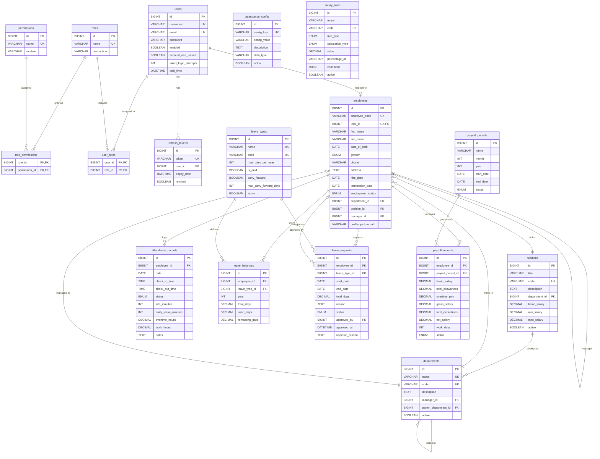

# Entity Relationship Diagram (ERD)

## 1. Module-Level Dependency Diagram

This diagram illustrates the high-level dependencies between the core modules in the HRMS application.

---

## 2. Full Database ER Diagram

The following Mermaid ER diagram shows the tables, columns, and relationship cardinalities across all modules.

---

## 3. Relationships Summary Table

| Entity (Source) | Relationship | Entity (Target) | Cardinality | Notes |
| :--- | :--- | :--- | :--- | :--- |
| `users` | One-to-One | `employees` | 1:1 | An employee profile corresponds to exactly one user account. |
| `users` | One-to-Many | `refresh_tokens` | 1:N | A user can have multiple active devices/tokens. |
| `users` | Many-to-Many | `roles` | M:N | Resolved via `user_roles`. |
| `roles` | Many-to-Many | `permissions` | M:N | Resolved via `role_permissions`. |
| `departments` | One-to-One | `employees` | 1:1 | An employee can manage a department. |
| `departments` | One-to-Many | `departments` | 1:N | Self-referencing to represent hierarchy (parent_department_id). |
| `departments` | One-to-Many | `positions` | 1:N | Positions are department-specific. |
| `employees` | One-to-Many | `employees` | 1:N | Self-referencing to represent manager-subordinate relationship. |
| `employees` | Many-to-One | `departments` | N:1 | Employees belong to one department. |
| `employees` | Many-to-One | `positions` | N:1 | Employees hold one position. |
| `employees` | One-to-Many | `attendance_records` | 1:N | Daily logs for each employee. |
| `employees` | One-to-Many | `leave_balances` | 1:N | Quota per leave type per year. |
| `employees` | One-to-Many | `leave_requests` | 1:N | Submitted time-off requests. |
| `employees` | One-to-Many | `payroll_records` | 1:N | Historical processed salaries. |
| `leave_types` | One-to-Many | `leave_balances` | 1:N | Leave rules define how balances behave. |
| `payroll_periods` | One-to-Many | `payroll_records` | 1:N | Monthly run groups multiple employee pay slips. |
