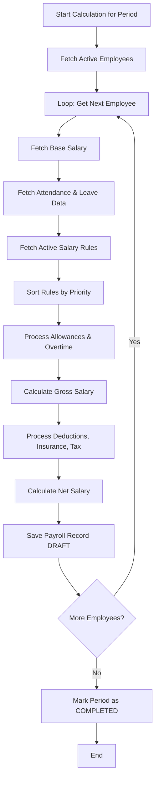
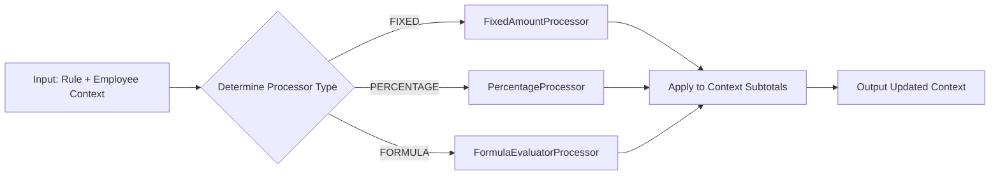
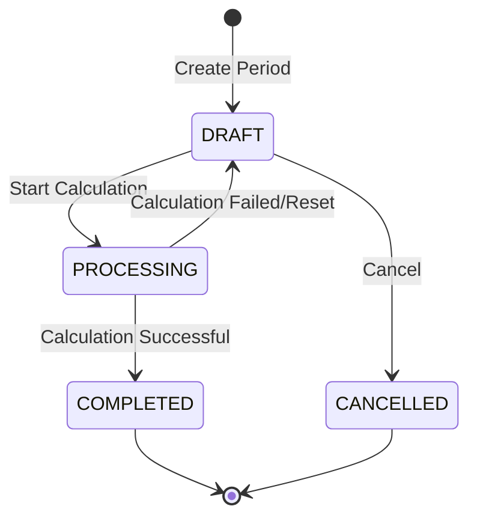

# Payroll Management Design Document

## 1. Salary Calculation Architecture

### 1.1 Design Pattern: Rule-Based Engine
The payroll module employs a **Rule-Based Engine** using the **Strategy Pattern** to ensure flexibility and maintainability.
- Salary calculation rules are decoupled from the code and stored in the `salary_rules` table.
- Each rule encapsulates specific metadata: `type`, `calculation_type`, `value`, `priority`, and conditional `conditions`.
- Rules are systematically evaluated and applied in ascending order of their `priority`.
- **Rule Types**: `ALLOWANCE`, `DEDUCTION`, `TAX`, `INSURANCE`, `OVERTIME`, `BONUS`.
- **Calculation Types**:
  - `FIXED`: A flat monetary amount.
  - `PERCENTAGE`: Calculated as a percentage of the base salary (or another designated base).
  - `FORMULA`: A custom mathematical expression evaluated dynamically.

### 1.2 Calculation Flow
The salary processing pipeline follows these sequential steps:
1. **Initialize**: Create or select the payroll period (e.g., Month/Year).
2. **Process Employees**: Iterate through each active employee associated with the period:
   1. Fetch the employee's `base_salary` defined by their position/contract.
   2. Retrieve aggregated attendance data for the period (work days, late counts, OT hours).
   3. Retrieve approved leave data for the period.
   4. **Apply Rules Pipeline** (in priority order):
      - Execute `ALLOWANCE` rules (FIXED or PERCENTAGE).
      - Execute `OVERTIME` rules (Formula: `overtime_hours × hourly_rate × overtime_multiplier`).
      - Compute Intermediate Metric: `gross_salary = base_salary + total_allowances + total_overtime`.
      - Execute `INSURANCE` deduction rules based on percentages.
      - Execute `TAX` rules (e.g., progressive tax brackets).
      - Execute other `DEDUCTION` rules (e.g., late penalties, absent deductions).
      - Compute Final Metric: `net_salary = gross_salary - total_deductions`.
   5. Save the computed values into a `payroll_record` for the employee.

---

## 2. Example Salary Rules Configuration

| Code | Name | Type | Calc Type | Value | Priority |
|------|------|------|-----------|-------|----------|
| `TRANSPORT` | Transport Allowance | ALLOWANCE | FIXED | 500000 | 10 |
| `MEAL` | Meal Allowance | ALLOWANCE | FIXED | 730000 | 20 |
| `HOUSING` | Housing Allowance | ALLOWANCE | PERCENTAGE | 10 (of basic) | 30 |
| `OT_PAY` | Overtime Pay | OVERTIME | FORMULA | hourly_rate × 1.5 × ot_hours | 40 |
| `SI` | Social Insurance | INSURANCE | PERCENTAGE | 8 (of basic) | 50 |
| `HI` | Health Insurance | INSURANCE | PERCENTAGE | 1.5 (of basic) | 60 |
| `UI` | Unemployment Insurance | INSURANCE | PERCENTAGE | 1 (of basic) | 70 |
| `PIT` | Personal Income Tax | TAX | PERCENTAGE | progressive | 80 |
| `LATE_PEN` | Late Penalty | DEDUCTION | FORMULA | late_count × 50000 | 90 |
| `ABSENT_DED`| Absent Deduction | DEDUCTION | FORMULA | absent_days × daily_rate| 100 |

---

## 3. Tax Calculation Reference (e.g., Vietnam PIT)
Tax calculations are designed to be configurable, supporting standard progressive models.
- **Taxable Income** = `Gross Salary` - `Total Insurance` - `Personal Deduction` (e.g., 11,000,000 VND) - (`Dependent Deduction` (e.g., 4,400,000 VND) × `Number of Dependents`).
- The progressive tax brackets are defined as JSON structures within the rule's `conditions` field, allowing the calculation processor to iterate and compute tax accordingly without hardcoded thresholds.

---

## 4. Lifecycle Management

### 4.1 Payroll Period Lifecycle
```
DRAFT → PROCESSING → COMPLETED
                    ↘ CANCELLED
```
- **DRAFT**: The payroll period has been initiated, but calculation processes have not yet started.
- **PROCESSING**: The payroll engine is actively crunching numbers for the period.
- **COMPLETED**: Calculations are finalized, reviewed, and locked. No further automated changes are permitted.
- **CANCELLED**: The period was aborted or deemed invalid.

### 4.2 Payroll Record Lifecycle
```
DRAFT → CONFIRMED → PAID
```
- **DRAFT**: Initial calculated state, pending HR review.
- **CONFIRMED**: Approved by HR management.
- **PAID**: Funds have been disbursed.

---

## 5. Extensibility Points
- **Zero-Code Rule Addition**: New salary components (allowances, standard deductions) can be introduced via the `salary_rules` table without requiring application redeployment.
- **Conditional Application**: The JSON `conditions` structure allows rules to target specific demographics (e.g., applying a hazard pay allowance only to the 'Warehouse' department).
- **Strategy Pattern Implementation**: The `SalaryCalculationService` delegates rule execution to a registry of `SalaryRuleProcessor` beans. Introducing a novel calculation methodology merely requires implementing a new processor bean.
- **Future Capabilities (V3)**: The foundation supports seamless integration of PDF payslip generation and automated email distribution upon period completion.

---

## 6. Flow Diagrams

### 6.1 Full Payroll Calculation Process



### 6.2 Salary Rule Processing Pipeline



### 6.3 Payroll Period State Machine



---

## 7. Edge Cases
- **Mid-Month Joiners**: Salary calculations must pro-rate base salary based on the exact joined date relative to the period's standard working days.
- **Mid-Month Terminations**: Similar to joiners, final settlement calculations require precise pro-ration.
- **Zero Overtime**: If overtime hours equal zero, overtime calculation rules are bypassed to optimize performance.
- **Missing Rules Config**: If no salary rules exist, the system logs a critical warning and defaults to basic salary or errors out depending on strict configuration.
- **Completed Period Recalculation**: Standard processing blocks recalculations on a `COMPLETED` period. Authorized administrators can explicitly override or reset the period to `DRAFT` to force recalculation.
