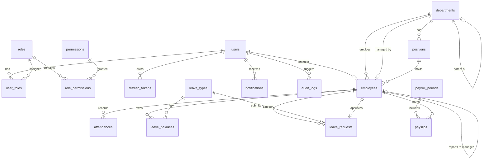
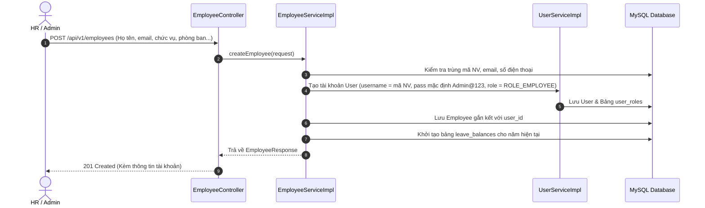

# TÀI LIỆU TỔNG QUAN HỆ THỐNG QUẢN LÝ NHÂN SỰ (HRMS)
> **Dành cho Developer: Học tập, Hiểu sâu Kiến trúc & Hướng dẫn Mở rộng Mã Nguồn**

---

## 1. TỔNG QUAN HỆ THỐNG VÀ TECH STACK

Hệ thống **HR Management System (HRMS)** là một ứng dụng quản trị nguồn nhân lực doanh nghiệp hoàn chỉnh theo mô hình **Monolithic Clean Architecture** ở Backend kết hợp **Modular Single Page Application (SPA)** ở Frontend.

```
+-----------------------------------------------------------------------------------+
|                                FRONTEND (React 19 SPA)                            |
|  Vite + TypeScript + TailwindCSS + Zustand + React Router v7 + Lucide + Sonner   |
+------------------------------------------+----------------------------------------+
                                           | HTTP RESTful APIs (JWT Bearer Token)
                                           | WebSocket / STOMP (/ws-hrms)
+------------------------------------------v----------------------------------------+
|                             BACKEND (Spring Boot 3.4.x)                           |
|  - Security Layer: Spring Security 6, JWT Filter, RBAC Role & Permission Matrix    |
|  - Controller Layer: REST Controllers, OpenAPI / Swagger Documentation            |
|  - Service Layer: Business Logic, POI Excel Services, OpenPDF, Audit Logging      |
|  - Repository Layer: Spring Data JPA, Hibernate, Criteria API / JPQL Queries       |
|  - Migration Engine: Flyway Database Versioning                                   |
+------------------------------------------+----------------------------------------+
                                           | JDBC Connection Pool (HikariCP)
+------------------------------------------v----------------------------------------+
|                                DATABASE & CACHE                                   |
|  - Relational DB: MySQL 8.0 (InnoDB Engine, utf8mb4 collation)                    |
|  - In-Memory Cache & Session (Optional): Redis 7.x                                |
+-----------------------------------------------------------------------------------+
```

### Công nghệ cốt lõi:
- **Backend**: Java 21 LTS, Spring Boot 3.4.x, Spring Security 6, Spring Data JPA, Flyway Migration, MapStruct, Lombok, Apache POI 5.3 (Excel), OpenPDF (PDF Generator), JJWT (JSON Web Token).
- **Frontend**: React 19, TypeScript 5, Vite, TailwindCSS 4, Zustand (State Management), React Router v7, Axios, i18next (Đa ngôn ngữ), Lucide Icons, Sonner (Toast notifications).
- **Cơ sở dữ liệu**: MySQL 8.0, Redis 7.
- **Triển khai**: Docker & Docker Compose (Multi-container build).

---

## 2. THIẾT KẾ CƠ SỞ DỮ LIỆU (DATABASE SCHEMA & ERD)

### 2.1 Sơ đồ Quan hệ Thực thể (Entity Relationship Diagram - ERD)



---

### 2.2 Chi tiết các Bảng Dữ liệu & Ý nghĩa Nghiệp vụ

#### A. Nhóm Xác thực, Người dùng & Phân quyền (Auth & RBAC)

1. **`users`**: Tài khoản người dùng đăng nhập hệ thống.
   - `id` (BIGINT, PK, Auto Increment)
   - `username` (VARCHAR(50), Unique, Not Null): Tên đăng nhập.
   - `email` (VARCHAR(100), Unique, Not Null): Email tài khoản.
   - `password` (VARCHAR(255), Not Null): Mật khẩu băm chuẩn BCrypt ($2a$10$...).
   - `enabled` (BOOLEAN, Default TRUE): Trạng thái tài khoản hoạt động/bị khóa.
   - `account_non_locked` (BOOLEAN, Default TRUE): Khóa tự động khi nhập sai mật khẩu quá 5 lần.
   - `failed_login_attempts` (INT, Default 0): Đếm số lần đăng nhập thất bại.
   - `lock_time` (DATETIME, Nullable): Thời điểm tài khoản bị khóa.
   - `created_at`, `updated_at`, `created_by`, `updated_by` (Audit fields kế thừa từ `BaseEntity`).

2. **`roles`**: Danh mục vai trò hệ thống (`ROLE_ADMIN`, `ROLE_HR`, `ROLE_MANAGER`, `ROLE_EMPLOYEE`).
   - `id` (BIGINT, PK)
   - `name` (VARCHAR(50), Unique, Not Null)
   - `description` (VARCHAR(255))

3. **`permissions`**: Quyền hạn chi tiết theo module (`EMPLOYEE_CREATE`, `LEAVE_APPROVE`, `PAYROLL_MANAGE`,...).
   - `id` (BIGINT, PK)
   - `name` (VARCHAR(100), Unique, Not Null)
   - `module` (VARCHAR(50), Not Null)

4. **`user_roles`** & **`role_permissions`**: Bảng liên kết nhiều - nhiều (Many-to-Many).
   - `user_roles(user_id, role_id)`
   - `role_permissions(role_id, permission_id)`

5. **`refresh_tokens`**: Quản lý phiên làm việc & cấp lại JWT Token.
   - `id` (BIGINT, PK)
   - `user_id` (BIGINT, FK -> `users.id`)
   - `token` (VARCHAR(500), Unique, Not Null)
   - `expiry_date` (DATETIME, Not Null)
   - `revoked` (BOOLEAN, Default FALSE)

---

#### B. Nhóm Cơ cấu Tổ chức & Hồ sơ Nhân sự (Organization & Employee)

6. **`departments`**: Phòng ban doanh nghiệp.
   - `id` (BIGINT, PK)
   - `code` (VARCHAR(20), Unique, Not Null): Mã phòng ban (ví dụ: `IT`, `HR`, `SALE`, `FIN`).
   - `name` (VARCHAR(100), Unique, Not Null): Tên phòng ban.
   - `description` (TEXT)
   - `manager_id` (BIGINT, FK -> `employees.id`, Nullable): Trưởng phòng ban.
   - `parent_department_id` (BIGINT, FK -> `departments.id`, Nullable): Phục vụ cây phân cấp phòng ban cha - con.
   - `active` (BOOLEAN, Default TRUE)

7. **`positions`**: Chức vụ / Vị trí công việc.
   - `id` (BIGINT, PK)
   - `code` (VARCHAR(20), Unique, Not Null): Mã chức vụ (ví dụ: `DEV_SR`, `HR_LEAD`).
   - `title` (VARCHAR(100), Not Null): Tên chức vụ.
   - `department_id` (BIGINT, FK -> `departments.id`, Nullable): Trực thuộc phòng ban.
   - `basic_salary` (DECIMAL(15,2), Default 0.00): Mức lương cơ sở định mức.
   - `min_salary`, `max_salary` (DECIMAL(15,2)): Khung dải lương (Salary Band).
   - `active` (BOOLEAN, Default TRUE)

8. **`employees`**: Hồ sơ lý lịch nhân sự cốt lõi.
   - `id` (BIGINT, PK)
   - `employee_code` (VARCHAR(20), Unique, Not Null): Mã nhân viên định danh (ví dụ: `EMP-0001`, `EMP-2026-001`).
   - `user_id` (BIGINT, FK -> `users.id`, Unique, Nullable): Liên kết tài khoản đăng nhập tương ứng.
   - `first_name` (VARCHAR(50), Not Null), `last_name` (VARCHAR(50), Not Null)
   - `date_of_birth` (DATE), `gender` (`MALE`, `FEMALE`, `OTHER`)
   - `phone` (VARCHAR(20)), `address` (TEXT)
   - `hire_date` (DATE, Not Null): Ngày bắt đầu vào công ty.
   - `termination_date` (DATE, Nullable): Ngày chính thức nghỉ việc.
   - `employment_status` (`PROBATION` - Thử việc, `ACTIVE` - Chính thức, `ON_LEAVE` - Tạm nghỉ, `TERMINATED` - Đã nghỉ việc).
   - `department_id` (BIGINT, FK -> `departments.id`)
   - `position_id` (BIGINT, FK -> `positions.id`)
   - `manager_id` (BIGINT, FK -> `employees.id`): Quản lý trực tiếp (Direct Manager).

---

#### C. Nhóm Chấm công & Quản lý Nghỉ phép (Attendance & Leave)

9. **`attendances`**: Bảng dữ liệu chấm công theo ngày.
   - `id` (BIGINT, PK)
   - `employee_id` (BIGINT, FK -> `employees.id`, Not Null)
   - `work_date` (DATE, Not Null): Ngày làm việc.
   - `check_in` (DATETIME, Nullable): Thời điểm quẹt thẻ / bấm nút vào ca.
   - `check_out` (DATETIME, Nullable): Thời điểm quẹt thẻ / bấm nút ra ca.
   - `status` (`PRESENT` - Đúng giờ, `LATE` - Đi muộn, `EARLY_LEAVE` - Về sớm, `LATE_AND_EARLY_LEAVE` - Vừa muộn vừa về sớm, `ABSENT` - Vắng mặt, `ON_LEAVE` - Nghỉ phép).
   - `total_work_hours` (DECIMAL(4,2), Default 0.00): Tổng thời gian làm việc thực tế tính theo giờ (ví dụ `8.00`, `7.50`).
   - `notes` (TEXT): Ghi chú ca làm hoặc lý do đi muộn/về sớm.
   - *Ràng buộc*: `uk_emp_work_date UNIQUE(employee_id, work_date)`.

10. **`leave_types`**: Danh mục loại nghỉ phép (`ANNUAL` - Phép năm, `SICK` - Nghỉ ốm, `MATERNITY` - Thai sản, `UNPAID` - Nghỉ không lương).
    - `id` (BIGINT, PK)
    - `code` (VARCHAR(30), Unique, Not Null), `name` (VARCHAR(100), Unique, Not Null)
    - `paid` (BOOLEAN, Default TRUE): Có được hưởng nguyên lương hay không.
    - `default_days_per_year` (INT, Default 12): Hạn mức số ngày mặc định trong năm.

11. **`leave_balances`**: Hạn mức ngày phép còn lại của từng nhân viên theo năm.
    - `id` (BIGINT, PK)
    - `employee_id` (BIGINT, FK -> `employees.id`)
    - `leave_type_id` (BIGINT, FK -> `leave_types.id`)
    - `year` (INT): Năm tính phép (ví dụ `2026`).
    - `total_days` (DECIMAL(4,1), Default 12.0)
    - `used_days` (DECIMAL(4,1), Default 0.0)
    - `remaining_days` (DECIMAL(4,1), Default 12.0)
    - *Ràng buộc*: `uk_emp_leave_year UNIQUE(employee_id, leave_type_id, year)`.

12. **`leave_requests`**: Đơn xin nghỉ phép của nhân viên.
    - `id` (BIGINT, PK)
    - `employee_id` (BIGINT, FK -> `employees.id`)
    - `leave_type_id` (BIGINT, FK -> `leave_types.id`)
    - `start_date` (DATE, Not Null), `end_date` (DATE, Not Null)
    - `total_days` (DECIMAL(4,1), Not Null)
    - `reason` (TEXT): Lý do xin nghỉ.
    - `status` (`PENDING`, `APPROVED`, `REJECTED`, `CANCELLED`)
    - `approver_id` (BIGINT, FK -> `employees.id`, Nullable): Người phê duyệt (Manager hoặc HR).
    - `rejection_reason` (TEXT): Lý do từ chối nếu có.

---

#### D. Nhóm Tiền lương & Bảng lương (Payroll & Payslips)

13. **`payroll_periods`**: Kỳ tính lương theo tháng.
    - `id` (BIGINT, PK)
    - `name` (VARCHAR(100), Not Null): Tên kỳ lương (ví dụ: `Bảng lương Tháng 08/2026`).
    - `year` (INT, Not Null), `month` (INT, Not Null)
    - `start_date` (DATE, Not Null), `end_date` (DATE, Not Null)
    - `working_days` (INT, Default 22): Số ngày công chuẩn của tháng.
    - `status` (`DRAFT` - Bản nháp, `PROCESSING` - Đang tính, `COMPLETED` - Đã tính toán xong, `APPROVED` - Đã khóa & phê duyệt chi trả).
    - *Ràng buộc*: `uk_payroll_year_month UNIQUE(year, month)`.

14. **`payslips`**: Phiếu lương chi tiết của từng nhân sự trong kỳ.
    - `id` (BIGINT, PK)
    - `payroll_period_id` (BIGINT, FK -> `payroll_periods.id`)
    - `employee_id` (BIGINT, FK -> `employees.id`)
    - `basic_salary` (DECIMAL(15,2)): Lương cơ bản theo chức vụ/hợp đồng.
    - `actual_work_days` (DECIMAL(4,1)): Tổng số ngày công thực tế làm việc trong tháng (tổng hợp từ bảng `attendances`).
    - `gross_salary` (DECIMAL(15,2)): Tổng thu nhập gộp = `(basic_salary / working_days * actual_work_days) + allowances`.
    - `allowances` (DECIMAL(15,2)): Các khoản phụ cấp (ăn trưa, xăng xe, trách nhiệm).
    - `deductions` (DECIMAL(15,2)): Các khoản trích đóng bảo hiểm (BHXH 8%, BHYT 1.5%, BHTN 1%).
    - `tax` (DECIMAL(15,2)): Thuế thu nhập cá nhân (TNCN) tạm tính.
    - `net_salary` (DECIMAL(15,2)): Tiền lương thực lĩnh = `gross_salary - deductions - tax`.
    - `status` (`CALCULATED`, `PAID`, `CANCELLED`).
    - `notes` (TEXT).
    - *Ràng buộc*: `uk_period_emp UNIQUE(payroll_period_id, employee_id)`.

---

#### E. Nhóm Nhật ký Hệ thống & Thông báo (Audit & Notifications)

15. **`audit_logs`**: Nhật ký lưu vết toàn bộ thao tác quan trọng (Audit Trail).
    - `id` (BIGINT, PK)
    - `user_id` (BIGINT, Nullable), `username` (VARCHAR(50))
    - `action` (`CREATE`, `UPDATE`, `DELETE`, `LOGIN`, `CHECK_IN`, `APPROVE_LEAVE`, `CALCULATE_PAYROLL`,...)
    - `entity_name` (VARCHAR(50)): Tên bảng bị tác động (`Employee`, `Department`, `LeaveRequest`,...).
    - `entity_id` (BIGINT, Nullable): ID của bản ghi bị tác động.
    - `details` (TEXT): Chi tiết JSON giá trị trước/sau thay đổi.
    - `ip_address` (VARCHAR(45)), `created_at` (DATETIME).

16. **`notifications`**: Thông báo trong ứng dụng cho người dùng.
    - `id` (BIGINT, PK)
    - `user_id` (BIGINT, FK -> `users.id`)
    - `type` (`LEAVE_REQUEST`, `LEAVE_STATUS`, `PAYSLIP_READY`, `ATTENDANCE_ALERT`, `SYSTEM_NOTICE`)
    - `title` (VARCHAR(255)), `message` (TEXT), `link` (VARCHAR(255))
    - `is_read` (BOOLEAN, Default FALSE), `created_at` (DATETIME).

---

## 3. CÁC QUY TRÌNH NGHIỆP VỤ CỐT LÕI (CORE BUSINESS LOGIC)

### 3.1 Quy trình Tạo Nhân Viên & Cấp Tài Khoản Tự Động


---

### 3.2 Quy trình Chấm Công (Xác nhận Modal & Thuật toán tính Đi muộn / Về sớm)
- **Chuẩn giờ làm việc**:
  - Giờ bắt đầu chuẩn: **`08:30`**.
  - Giờ kết thúc ca chuẩn: **`17:30`**.
  - Giờ nghỉ trưa: **`12:00 - 13:00`** (1 giờ).
- **Thuật toán phân loại trạng thái**:
  - Nếu `check_in > 08:30` $\rightarrow$ Đánh dấu `LATE` (Đi muộn $X$ phút).
  - Nếu `check_out < 17:30` $\rightarrow$ Đánh dấu `EARLY_LEAVE` (Về sớm $Y$ phút).
  - Nếu vừa check_in muộn, vừa check_out sớm $\rightarrow$ Đánh dấu `LATE_AND_EARLY_LEAVE`.
  - Nếu check_in $\le$ 08:30 và check_out $\ge$ 17:30 $\rightarrow$ `PRESENT` (Đúng giờ).
  - Số giờ làm `total_work_hours` = $(\text{CheckOut} - \text{CheckIn} - \text{1h nghỉ trưa})$.

---

### 3.3 Quy trình Tính Lương Tự Động (Payroll Calculation Engine)
Khi HR bấm **"Tính toán lương kỳ này"** (`POST /api/v1/payroll/periods/{id}/calculate`):
1. Lấy danh sách tất cả nhân viên có trạng thái `ACTIVE` hoặc `PROBATION`.
2. Với mỗi nhân viên:
   - Truy vấn bảng `attendances` trong khoảng từ `start_date` đến `end_date` của kỳ lương.
   - Tính tổng số ngày công thực tế `actual_work_days`: Mỗi ngày công đủ 8 tiếng = 1.0 công; nửa buổi = 0.5 công; nghỉ có phép (`ON_LEAVE` có lương) = 1.0 công.
   - Lấy mức `basic_salary` từ Chức vụ (`Position`) của nhân viên.
   - **Lương theo công**: $\text{Lương cơ bản} \times (\text{Số ngày công thực tế} / \text{Ngày công chuẩn 22})$.
   - **Khoản trích bảo hiểm**: $\text{Lương cơ bản} \times 10.5\%$ (BHXH 8% + BHYT 1.5% + BHTN 1%).
   - **Thuế TNCN tạm tính**: Áp dụng biểu thuế lũy tiến từng phần sau khi giảm trừ gia cảnh 11,000,000đ.
   - **Thực lĩnh (Net)** = $(\text{Lương theo công} + \text{Phụ cấp}) - \text{Bảo hiểm} - \text{Thuế TNCN}$.
3. Lưu hoặc cập nhật bản ghi vào bảng `payslips`.
4. Cập nhật trạng thái kỳ lương sang `COMPLETED`.

---

### 3.4 Quy trình Xuất & Nhập File Excel Đa Module
Hệ thống sử dụng **Apache POI** (`ExcelExportService` & `ExcelImportService`):
1. **Xuất Excel (Export)**:
   - Các bảng hỗ trợ xuất Excel trực tiếp: Nhân viên (`/employees/export`), Bảng chấm công (`/attendances/export`), Bảng lương kỳ (`/payroll/periods/{id}/export-excel`), Phòng ban (`/departments/export`), Chức vụ (`/positions/export`).
   - Tự động format Tiêu đề cột in đậm (Bold Header, nền xanh), căn chỉnh Auto-size độ rộng cột, định dạng số tiền VND (Currency CellStyle) và ngày tháng chuẩn.
2. **Nhập Excel Hàng Loạt (Batch Import)**:
   - Hỗ trợ tải File mẫu chuẩn (`/template`).
   - Đọc từng dòng (Row-by-Row validation), ghi nhận lỗi cụ thể (Dòng bao nhiêu, Cột nào, Nguyên nhân gì).
   - Tổng kết thống kê: `totalRows`, `successCount`, `failedCount`, và danh sách `errors` hiển thị trực tiếp lên Modal Frontend.

---

## 4. CẤU TRÚC MÃ NGUỒN VÀ TỔ CHỨC THƯ MỤC

### 4.1 Cấu trúc Backend (`com.ng_doanh.hr_management_system`)
```
src/main/java/com/ng_doanh/hr_management_system/
├── common/                  # Các thành phần dùng chung toàn hệ thống
│   ├── config/              # SecurityConfig, CorsConfig, SwaggerConfig, AuditingConfig
│   ├── constant/            # ApiPaths, SecurityConstants
│   ├── dto/                 # ApiResponse, PageResponse, ImportErrorDetail, ImportResultResponse
│   ├── entity/              # BaseEntity (createdAt, updatedAt, createdBy, updatedBy)
│   ├── enums/               # ResponseCode
│   ├── exception/           # BusinessException, GlobalExceptionHandler
│   ├── security/            # JwtAuthenticationFilter, JwtTokenProvider, CustomUserDetails
│   └── util/                # ExcelHelper, DateUtils
├── auth/                    # Module Xác thực & Quản lý Tài khoản (User, Role, Permission)
├── employee/                # Module Quản lý Nhân sự (Employee Entity, Service, Controller)
├── department/              # Module Quản lý Phòng ban (Department)
├── position/                # Module Quản lý Chức vụ (Position)
├── attendance/              # Module Chấm công (Attendance)
├── leave/                   # Module Quản lý Nghỉ phép (LeaveType, LeaveBalance, LeaveRequest)
├── payroll/                 # Module Tính lương (PayrollPeriod, Payslip)
├── audit/                   # Module Nhật ký Kiểm toán (AuditLog, AOP Interceptors)
├── notification/            # Module Thông báo Realtime (Notification, WebSocket)
└── report/                  # Module Báo cáo, Xuất Nhập Excel & PDF
```

### 4.2 Cấu trúc Frontend (`frontend/src/`)
```
frontend/src/
├── api/                     # Axios API clients (auth, employee, attendance, payroll, user, ...)
├── components/
│   ├── layout/              # AppLayout, Navbar, Sidebar, NotificationDropdown
│   └── shared/              # DataTable, AdvancedFilterBar, PageHeader, FormField,
│                            # StatusBadge, ConfirmDialog, ImportExcelModal
├── features/                # Các trang chức năng theo từng module
│   ├── auth/                # LoginPage, ResetPasswordModal
│   ├── dashboard/           # DashboardPage (Thống kê biểu đồ, KPI cards)
│   ├── employees/           # EmployeeListPage, EmployeeDetailPage, EmployeeFormPage
│   ├── attendance/          # AttendancePage (Chấm công cá nhân), AttendanceAdminPage,
│                            # CheckInConfirmModal, CheckOutConfirmModal
│   ├── leave/               # LeaveListPage, LeaveRequestModal, LeaveTypeManagement
│   ├── payroll/             # PayrollPeriodListPage, PayslipListPage, MyPayslipPage
│   ├── departments/         # DepartmentListPage
│   ├── positions/           # PositionListPage
│   ├── users/               # UserListPage (Quản lý tài khoản hệ thống)
│   ├── audit/               # AuditLogPage
│   └── reports/             # ReportDashboardPage
├── router/                  # index.tsx (React Router cấu hình RBAC ProtectedRoute)
├── stores/                  # Zustand stores (authStore, themeStore, notificationStore)
└── types/                   # TypeScript interfaces & DTO definitions
```

---

## 5. HƯỚNG DẪN TỪNG BƯỚC MỞ RỘNG MÃ NGUỒN (DEVELOPER CUSTOMIZATION GUIDE)

Khi bạn muốn **thêm một Module mới** (ví dụ: *Quản lý Khen thưởng - Kỷ luật `RewardDiscipline`* hoặc *Quản lý Hợp đồng lao động `Contract`*), hãy thực hiện theo đúng 9 bước chuẩn mực sau:

### Bước 1: Tạo Database Migration (Flyway SQL)
Tạo file `src/main/resources/db/migration/V11__create_contract_table.sql`:
```sql
CREATE TABLE contracts (
    id BIGINT AUTO_INCREMENT PRIMARY KEY,
    employee_id BIGINT NOT NULL,
    contract_number VARCHAR(50) NOT NULL UNIQUE,
    contract_type VARCHAR(30) NOT NULL, -- INDEFINITE, DEFINITE_1_YEAR, INTERNSHIP
    start_date DATE NOT NULL,
    end_date DATE NULL,
    salary DECIMAL(15,2) NOT NULL,
    status VARCHAR(20) NOT NULL DEFAULT 'ACTIVE',
    created_at DATETIME NOT NULL DEFAULT CURRENT_TIMESTAMP,
    updated_at DATETIME NOT NULL DEFAULT CURRENT_TIMESTAMP ON UPDATE CURRENT_TIMESTAMP,
    created_by BIGINT NULL,
    updated_by BIGINT NULL,
    CONSTRAINT fk_contract_emp FOREIGN KEY (employee_id) REFERENCES employees(id) ON DELETE CASCADE
);
```

### Bước 2: Tạo Entity kế thừa `BaseEntity`
```java
@Entity
@Table(name = "contracts")
@Getter @Setter @NoArgsConstructor @AllArgsConstructor @Builder
public class Contract extends BaseEntity {
    @ManyToOne(fetch = FetchType.LAZY, optional = false)
    @JoinColumn(name = "employee_id", nullable = false)
    private Employee employee;

    @Column(name = "contract_number", nullable = false, unique = true, length = 50)
    private String contractNumber;

    @Enumerated(EnumType.STRING)
    @Column(name = "contract_type", nullable = false)
    private ContractType contractType;

    @Column(name = "start_date", nullable = false)
    private LocalDate startDate;

    @Column(name = "end_date")
    private LocalDate endDate;

    @Column(nullable = false, precision = 15, scale = 2)
    private BigDecimal salary;
}
```

### Bước 3: Tạo Repository với Spring Data JPA & JPQL Search
```java
@Repository
public interface ContractRepository extends JpaRepository<Contract, Long> {
    @Query("SELECT c FROM Contract c WHERE " +
           "(:keyword IS NULL OR LOWER(c.contractNumber) LIKE LOWER(CONCAT('%', :keyword, '%')) " +
           "OR LOWER(c.employee.firstName) LIKE LOWER(CONCAT('%', :keyword, '%'))) " +
           "AND (:employeeId IS NULL OR c.employee.id = :employeeId)")
    Page<Contract> searchContracts(@Param("keyword") String keyword, 
                                   @Param("employeeId") Long employeeId, 
                                   Pageable pageable);
}
```

### Bước 4: Tạo DTOs (Request / Response) & MapStruct Mapper
- `ContractCreateRequest.java` (có `@NotBlank`, `@NotNull`, `@Future` validation annotations).
- `ContractResponse.java`.
- `ContractMapper.java` (@Mapper(componentModel = "spring")).

### Bước 5: Viết Service Interface & Implementation
- Khai báo `@Service`, `@Transactional`, `@RequiredArgsConstructor`.
- Kiểm tra logic nghiệp vụ, ném `BusinessException(ResponseCode.RESOURCE_ALREADY_EXISTS)` nếu trùng số hợp đồng.
- Bắn sự kiện Audit log hoặc Notification nếu cần.

### Bước 6: Viết REST Controller với OpenAPI & PreAuthorize
```java
@RestController
@RequestMapping(ApiPaths.CONTRACTS_BASE)
@RequiredArgsConstructor
@Tag(name = "Contract Management")
public class ContractController {
    private final ContractService contractService;

    @PostMapping
    @PreAuthorize(SecurityConstants.HAS_ROLE_HR_OR_ADMIN)
    public ApiResponse<ContractResponse> create(@Valid @RequestBody ContractCreateRequest req, HttpServletRequest request) {
        return ApiResponse.success(ResponseCode.CREATED, contractService.create(req), request.getRequestURI());
    }
}
```

### Bước 7: Thêm TypeScript Types & API Client ở Frontend
- Trong `frontend/src/types/index.ts`: Thêm interface `ContractResponse`, `ContractCreateRequest`.
- Trong `frontend/src/api/contract.api.ts`: Viết các hàm gọi `apiClient.get`, `apiClient.post`,...

### Bước 8: Tạo Trang Giao Diện (Feature Page)
- Tạo `frontend/src/features/contracts/pages/ContractListPage.tsx`.
- Sử dụng các components dùng chung: `<PageHeader>`, `<AdvancedFilterBar>`, `<DataTable>`, `<ConfirmDialog>`, `<ImportExcelModal>`.

### Bước 9: Đăng Ký Route & Menu Sidebar
- Trong `frontend/src/router/index.tsx`: Thêm route `/contracts` bọc trong `ProtectedRoute`.
- Trong `frontend/src/components/layout/Sidebar.tsx`: Thêm mục menu với icon phù hợp (ví dụ: `FileSignature`).

---

## 6. HƯỚNG DẪN CHẠY VÀ TRIỂN KHAI HỆ THỐNG

### Cách 1: Chạy toàn bộ hệ thống bằng Docker Compose (Khuyên dùng)
```bash
docker compose up -d --build
```
- Frontend UI: `http://localhost:5173` (hoặc port 80 nếu qua Nginx)
- Backend REST API: `http://localhost:8080`
- Swagger UI tài liệu API: `http://localhost:8080/swagger-ui/index.html`
- Tài khoản quản trị mặc định: `admin` / `Admin@123`

### Cách 2: Chạy trực tiếp trên IDE (Local Development)
1. **Khởi động MySQL**:
   - Tạo database `hrms_db`, user `root`, password `root` (hoặc sửa trong `application.yml`).
2. **Chạy Backend Spring Boot**:
   ```bash
   ./mvnw clean spring-boot:run
   ```
3. **Chạy Frontend React**:
   ```bash
   cd frontend
   npm install
   npm run dev
   ```

---
*Tài liệu được biên soạn đồng bộ trực tiếp với toàn bộ codebase của dự án HR Management System.*
