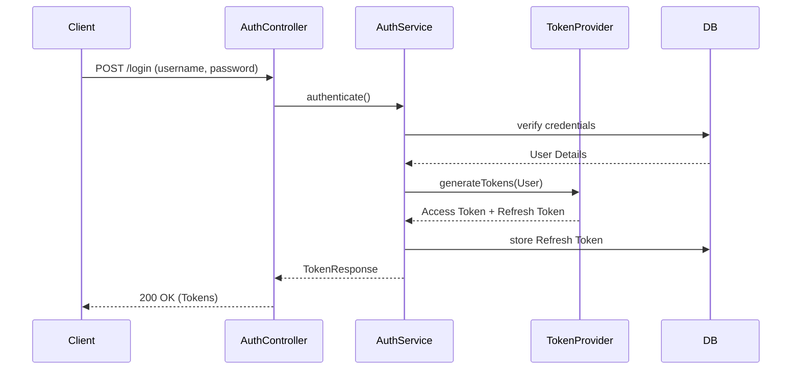
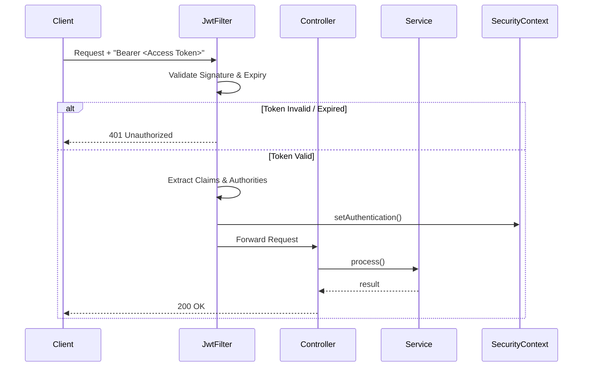
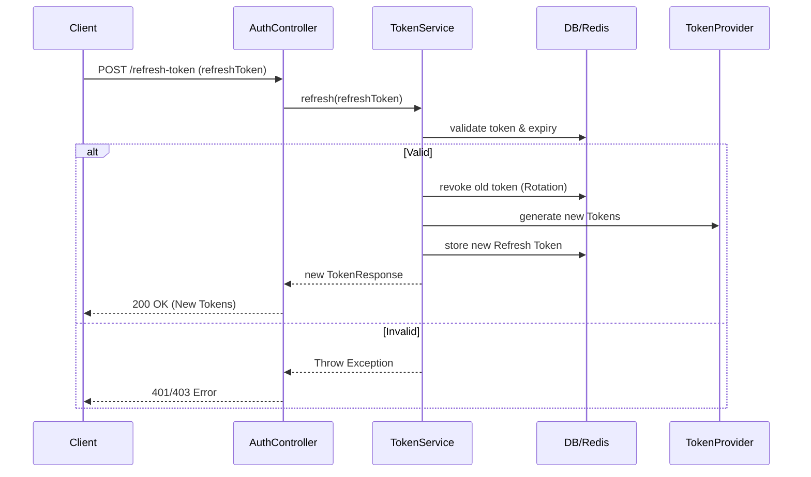
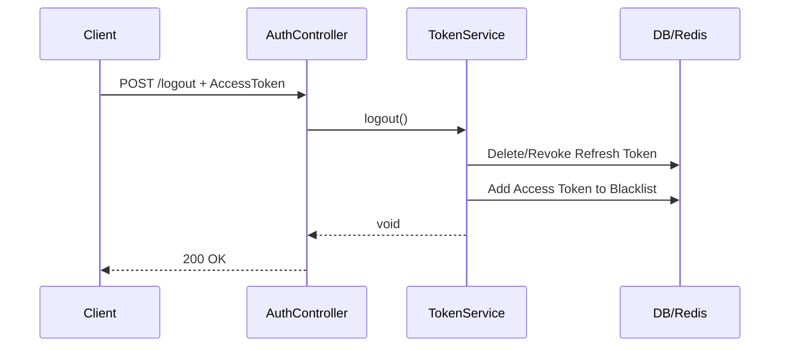

# Security Design Document - HR Management System (HRMS)

This document outlines the security architecture and design patterns for the HR Management System.

## 1. Authentication Flow

The system uses JWT-based authentication featuring a dual-token architecture:
- **Access Token**: Short-lived (30 minutes), used for authorization on protected endpoints. The client should store this in memory.
- **Refresh Token**: Long-lived (7 days), used to acquire new access tokens.

### Storage Strategy
- **Version 1 (V1)**: Refresh tokens are stored in the MySQL `refresh_tokens` table. A blacklist for revoked access tokens is maintained in an in-memory `Set`.
- **Version 2 (V2)**: Refresh token storage and access token blacklisting migrate to Redis for better scalability and multi-node support.

### Diagrams

#### Login Flow



#### Authenticated Request Flow



#### Token Refresh Flow



#### Logout Flow



---

## 2. Authorization (RBAC)

Authorization is managed via Role-Based Access Control (RBAC) combined with fine-grained permissions.

### Roles
- `ADMIN`: Full system access.
- `HR`: Human Resources staff, manage employees, payroll, and global leaves.
- `MANAGER`: Department heads, view department members, approve leaves.
- `EMPLOYEE`: Standard users, access own data only.

### Permissions (Examples)
- `EMPLOYEE_READ`, `EMPLOYEE_CREATE`, `EMPLOYEE_UPDATE`, `EMPLOYEE_DELETE`
- `LEAVE_APPROVE`, `LEAVE_READ`
- `PAYROLL_CALCULATE`

### Enforcement
- **Method-Level Security**: Implemented using Spring Security's `@PreAuthorize` annotations on controllers and services.
  ```java
  @PreAuthorize("hasAuthority('EMPLOYEE_CREATE') or hasRole('ADMIN')")
  public EmployeeResponse createEmployee(EmployeeCreateRequest request) { ... }
  ```
- **Data-Level Security**: Custom `PermissionEvaluator` ensures managers only access data within their own departments.

---

## 3. JWT Design

Tokens are generated using the `HS512` algorithm. The signing secret is injected from the environment and is never hardcoded.

### Token Claims
- `sub`: User ID
- `roles`: e.g., `["ROLE_HR", "ROLE_EMPLOYEE"]`
- `permissions`: e.g., `["EMPLOYEE_READ", "LEAVE_CREATE"]`
- `iat`: Issued At timestamp
- `exp`: Expiration timestamp

---

## 4. Password Security

- **Hashing**: Passwords are mathematically hashed using `BCryptPasswordEncoder`.
- **Validation Rules**: Minimum length of 8 characters, requiring mixed case, numbers, and symbols.
- **Lockout Policy**: Accounts are locked for 15 minutes after 5 consecutive failed login attempts to prevent brute-force attacks.

---

## 5. Security Headers and Configurations

- **CORS**: Configured via Spring Web to allow requests from designated frontend origins.
- **CSRF**: Disabled (`csrf().disable()`) since the application uses stateless JWT authentication rather than session cookies.
- **Content-Type**: Validation enforced for incoming requests to prevent malicious payload parsing.

---

## 6. V2 Migration Notes (Storage Layer Abstraction)

To ensure a seamless transition from V1 (MySQL + In-Memory) to V2 (Redis), the application uses an Interface-based design for token operations.

### Interface: `TokenStore`
```java
public interface TokenStore {
    void storeRefreshToken(String userId, String token, long expirationSeconds);
    boolean validateRefreshToken(String token);
    void revokeRefreshToken(String token);
    void blacklistAccessToken(String token, long expirationSeconds);
    boolean isAccessTokenBlacklisted(String token);
}
```

### V1 Implementation: `JdbcTokenStore`
- Uses JPA repositories to persist refresh tokens to the `refresh_tokens` MySQL table.
- Employs a concurrent `Set` or `Cache` (e.g., Caffeine) for blacklisted access tokens.

### V2 Implementation: `RedisTokenStore`
- Utilizes `StringRedisTemplate`.
- Stores refresh tokens with native Redis TTL.
- Blacklists access tokens in Redis sets with expiration aligning with the token's remaining validity time.
