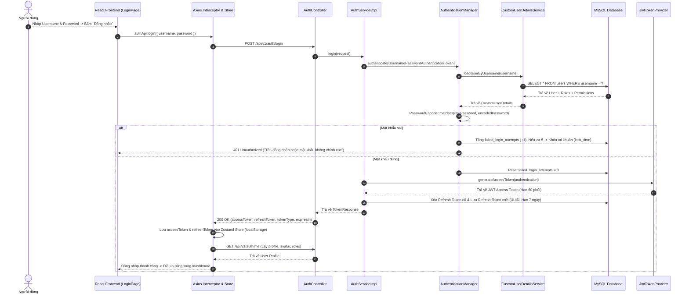

# TÀI LIỆU KIẾN TRÚC BẢO MẬT HỆ THỐNG HRMS
> **Phân tích Chuyên sâu: Cơ chế Xác thực JWT, Refresh Token, Stateless Session & Các Lớp Phòng thủ CSRF, XSS, Brute Force, SQL Injection**

---

## 1. BẢN CHẤT CÁC THÀNH PHẦN BẢO MẬT TRONG MÃ NGUỒN

### 1.1 Refresh Token được tạo ở đâu và như thế nào?

Trong mã nguồn Backend, **Refresh Token** được tạo trực tiếp tại lớp [`AuthServiceImpl.java`](file:///c:/Users/mrdoanh/IdeaProjects/hr-management-system/src/main/java/com/ng_doanh/hr_management_system/auth/service/impl/AuthServiceImpl.java) thông qua phương thức `createRefreshToken(User user)` (tại dòng 149 - 161):

```java
private RefreshToken createRefreshToken(User user) {
    // 1. Xóa các Refresh Token cũ của User để đảm bảo Single Active Session per Login
    refreshTokenRepository.deleteByUser(user);

    // 2. Sinh chuỗi ngẫu nhiên bảo mật 128-bit chuẩn UUID v4
    RefreshToken refreshToken = RefreshToken.builder()
            .user(user)
            .token(UUID.randomUUID().toString()) // Ví dụ: "c8e4f1a2-9b3d-4e8f-a1b2-c3d4e5f6a7b8"
            .expiryDate(Instant.now().plusMillis(jwtProperties.getRefreshTokenExpirationMs())) // Mặc định 7 ngày
            .revoked(false)
            .build();

    // 3. Lưu vào Database (bảng refresh_tokens)
    return refreshTokenRepository.save(refreshToken);
}
```

#### Quy trình sử dụng Refresh Token (`POST /api/v1/auth/refresh-token`):
1. Client gửi chuỗi `refreshToken` lên server khi `accessToken` hết hạn (nhận mã lỗi HTTP 401).
2. Server truy vấn trong bảng `refresh_tokens`:
   - Kiểm tra token có tồn tại không? (`RESOURCE_NOT_FOUND`).
   - Kiểm tra token đã bị thu hồi chưa? (`refreshToken.isRevoked() == true` $\rightarrow$ `INVALID_TOKEN`).
   - Kiểm tra token đã hết hạn chưa? (`refreshToken.getExpiryDate().isBefore(Instant.now())` $\rightarrow$ `TOKEN_EXPIRED`).
3. Nếu hợp lệ: Trích xuất `User`, nạp danh sách quyền hạn (Roles + Permissions), và gọi `jwtTokenProvider.generateAccessTokenFromUsername(...)` để sinh ra một `accessToken` mới gửi về cho client.

---

### 1.2 "Stateless" trong Spring Security có công dụng gì?

Trong file cấu hình [`SecurityConfig.java`](file:///c:/Users/mrdoanh/IdeaProjects/hr-management-system/src/main/java/com/ng_doanh/hr_management_system/common/config/SecurityConfig.java) (dòng 56):
```java
.sessionManagement(session -> session.sessionCreationPolicy(SessionCreationPolicy.STATELESS))
```

#### Công dụng & Ý nghĩa kỹ thuật:
1. **Không tạo & Không lưu `HttpSession` trên RAM Server**:
   - Máy chủ không lưu trữ bất kỳ trạng thái phiên làm việc nào của người dùng (không lưu `JSESSIONID` trong bộ nhớ Tomcat).
   - Giúp Server tiết kiệm tối đa bộ nhớ RAM, có thể chịu tải hàng triệu request đồng thời.
2. **Khả năng mở rộng ngang (Horizontal Scalability & Microservices Ready)**:
   - Trong hệ thống phân tán hoặc có Load Balancer (chạy 5 - 10 server Spring Boot đằng sau Nginx), Client gửi request đến bất kỳ Server nào cũng đều xác thực được ngay lập tức thông qua chữ ký số của JWT token mà **không cần cấu hình Sticky Session hay Session Replication qua Redis**.
3. **Triệt tiêu nguy cơ tấn công CSRF**:
   - Khi server không dùng Session Cookie để xác thực tự động, trình duyệt sẽ không tự đính kèm cookie đăng nhập khi người dùng click vào link độc hại từ trang web khác.

---

### 1.3 Bearer Token được gửi và xử lý như thế nào?

Hệ thống sử dụng cơ chế chuẩn **OAuth2 Bearer Token**:

```
+------------------+                                      +-------------------------+
|     FRONTEND     |                                      |         BACKEND         |
| (React + Axios)  |                                      | (Spring Security Filter)|
+--------+---------+                                      +------------+------------+
         |                                                             |
         | 1. Lấy token từ Zustand Store                              |
         | 2. Gắn Header:                                              |
         |    Authorization: Bearer eyJhbGciOi...                      |
         +─────────────────── HTTP Request ───────────────────────────>|
         |                                                             | 3. JwtAuthenticationFilter:
         |                                                             |    parseJwt() cắt bỏ "Bearer "
         |                                                             | 4. JwtTokenProvider:
         |                                                             |    validateToken(jwt)
         |                                                             | 5. Kiểm tra Redis Blacklist
         |                                                             | 6. Nạp thông tin vào
         |                                                             |    SecurityContextHolder
         |<────────────────── HTTP Response 200 OK ────────────────────+
```

1. **Phía Frontend ([`frontend/src/api/axios.ts`](file:///c:/Users/mrdoanh/IdeaProjects/hr-management-system/frontend/src/api/axios.ts))**:
   - Trước mọi request, **Axios Request Interceptor** tự động can thiệp:
   ```typescript
   apiClient.interceptors.request.use((config) => {
     const token = useAuthStore.getState().accessToken;
     if (token && config.headers) {
       config.headers.Authorization = `Bearer ${token}`;
     }
     return config;
   });
   ```
2. **Phía Backend ([`JwtAuthenticationFilter.java`](file:///c:/Users/mrdoanh/IdeaProjects/hr-management-system/src/main/java/com/ng_doanh/hr_management_system/common/security/JwtAuthenticationFilter.java))**:
   - Bộ lọc `OncePerRequestFilter` đón nhận request trước khi tới Controller.
   - Hàm `parseJwt(request)` đọc header `Authorization`:
   ```java
   String headerAuth = request.getHeader("Authorization");
   if (StringUtils.hasText(headerAuth) && headerAuth.startsWith("Bearer ")) {
       return headerAuth.substring(7); // Cắt lấy chuỗi token đằng sau chữ "Bearer "
   }
   ```
   - Xác thực tính toàn vẹn chữ ký HMAC-SHA512 bằng `jwtTokenProvider.validateToken(jwt)`.
   - Kiểm tra token có bị đưa vào danh sách đen do Logout không (`!redisTokenBlacklistService.isBlacklisted(jwt)`).
   - Nạp `UsernamePasswordAuthenticationToken` vào `SecurityContextHolder.getContext().setAuthentication(...)`.

---

## 2. LUỒNG ĐĂNG NHẬP CHI TIẾT (END-TO-END LOGIN FLOW)



---

## 3. CÁC TẦNG BẢO MẬT & CƠ CHẾ CHỐNG TẤN CÔNG

Hệ thống được thiết kế theo nguyên lý **Phòng thủ Đa tầng (Defense in Depth)** để vô hiệu hóa các lỗ hổng bảo mật phổ biến nhất theo chuẩn OWASP Top 10:

```
+-----------------------------------------------------------------------------------+
|                           CÁC LỚP BẢO MẬT HỆ THỐNG HRMS                           |
+-----------------------------------------------------------------------------------+
| 1. CHỐNG CSRF       -> Stateless JWT trong Header (Không dùng Cookie xác thực)   |
| 2. CHỐNG XSS        -> React JSX Auto-Escape, DTO Validation, Strict JSON         |
| 3. CHỐNG BRUTEFORCE -> BCrypt 10 rounds, Khóa tài khoản sau 5 lần sai             |
| 4. CHỐNG CHIẾM ĐOẠT -> Access Token ngắn hạn (1h) + Refresh Token luân chuyển     |
| 5. CHỐNG REPLAY/LOG -> Redis Token Blacklist khi đăng xuất                       |
| 6. CHỐNG SQL INJECT -> Spring Data JPA / Hibernate Parametric Queries (:param)    |
| 7. CHỐNG CLICKJACK  -> X-Frame-Options: SAMEORIGIN                                |
| 8. KIỂM SOÁT RBAC   -> Phân quyền kép (URL AntMatchers + @PreAuthorize Method)    |
+-----------------------------------------------------------------------------------+
```

---

### 3.1 Cơ chế Phòng chống CSRF (Cross-Site Request Forgery)

#### Câu hỏi cốt lõi: *Tại sao Backend tắt `csrf(AbstractHttpConfigurer::disable)` mà vẫn an toàn tuyệt đối?*

1. **Bản chất của cuộc tấn công CSRF**:
   - Kẻ tấn công tạo một website giả mạo (ví dụ `evil.com`). Khi nạn nhân vô tình click vào link, website này âm thầm gửi 1 request độc hại tới `hrms.com/api/v1/employees/delete/1`.
   - Nếu hệ thống dùng **Cookie/Session truyền thống**, trình duyệt của nạn nhân sẽ **tự động đính kèm Cookie đăng nhập** theo request độc hại đó $\rightarrow$ Server bị lừa và thực hiện hành động.
2. **Cách HRMS triệt tiêu hoàn toàn CSRF**:
   - Hệ thống hoạt động theo mô hình **Stateless**: Không sử dụng Cookie để lưu phiên xác thực.
   - Toàn bộ quyền xác thực nằm trong Header: `Authorization: Bearer <token>`.
   - Trình duyệt **KHÔNG BAO GIỜ tự động gửi Header `Authorization`** sang một domain khác trong các request ngầm. Chỉ có mã nguồn JavaScript chính chủ từ ứng dụng React mới có thể lấy token từ Zustand Store và gắn vào Header.
   - Vì vậy, kẻ tấn công từ trang web lạ không có cách nào gửi được Header chứa token $\rightarrow$ **CSRF hoàn toàn bị vô hiệu hóa**.
3. **Bổ trợ thêm bằng CORS Whitelisting**:
   - `SecurityConfig` cấu hình CORS nghiêm ngặt: Chỉ chấp nhận các Method (`GET`, `POST`, `PUT`, `DELETE`, `PATCH`, `OPTIONS`) và Headers chỉ định từ các nguồn được phép.

---

### 3.2 Cơ chế Phòng chống XSS (Cross-Site Scripting)

1. **Auto-Escaping ở Frontend (React Engine)**:
   - React mặc định escape (mã hóa các ký tự đặc biệt `< > & " '`) trước khi render ra DOM.
   - Không sử dụng `dangerouslySetInnerHTML` ở bất kỳ đâu trong toàn bộ mã nguồn Frontend. Nếu kẻ tấn công nhập dữ liệu có chứa `<script>alert('hack')</script>` vào ô Tên nhân viên hay Lý do nghỉ phép, React sẽ hiển thị nó dưới dạng văn bản thuần (plain text) chứ không thực thi mã script.
2. **Validation chặt chẽ tại Backend (Jakarta Validation & DTOs)**:
   - Tất cả dữ liệu đầu vào đều đi qua DTOs với các annotation kiểm soát chặt:
     - `@NotBlank`, `@Size(max = 50)`: Ngăn chặn payload quá dài hoặc injection.
     - `@Pattern(regexp = "^[A-Za-z0-9_.-]+$")`: Bắt buộc đúng định dạng cho Mã nhân viên, Username, Mã phòng ban.
3. **Ép kiểu Strict Content-Type `application/json`**:
   - Backend chỉ chấp nhận và trả về dữ liệu chuẩn JSON, không trả về HTML rendering từ server, ngăn chặn mã độc nhúng vào body response.

---

### 3.3 Cơ chế Chống Tấn công Dò Mật khẩu (Brute Force & Dictionary Attack)

1. **Mã hóa Mật khẩu Chuẩn BCrypt**:
   - Sử dụng `BCryptPasswordEncoder` với độ phức tạp cao (Work factor = 10). Mật khẩu lưu trong DB có dạng `$2a$10$...` với muối ngẫu nhiên (Salt), chống lại các bảng tra cứu mã băm sẵn (Rainbow Tables).
2. **Khóa Tài khoản Tự Động (Account Lockout Policy)**:
   - Trong bảng `users` có 3 trường theo dõi: `failed_login_attempts`, `account_non_locked`, `lock_time`.
   - Khi người dùng nhập sai mật khẩu liên tiếp **5 lần**:
     - `failed_login_attempts` chạm mốc 5.
     - `account_non_locked` chuyển sang `FALSE`.
     - `lock_time` ghi nhận thời điểm khóa.
     - Hệ thống từ chối mọi yêu cầu đăng nhập tiếp theo, ngăn chặn hoàn toàn các công cụ tự động dò quét mật khẩu.

---

### 3.4 Cơ chế Bảo vệ JWT & Ngăn chặn Chiếm đoạt Token (Token Hijacking)

1. **Phân tách Thời hạn Token (Short-lived Access Token & Long-lived Refresh Token)**:
   - `accessToken`: Hạn sử dụng ngắn (15 - 60 phút). Nếu token có vô tình bị lộ, kẻ tấn công cũng chỉ có thể lợi dụng trong khoảng thời gian rất ngắn.
   - `refreshToken`: Hạn 7 ngày, chỉ dùng duy nhất 1 mục đích là gọi API `/refresh-token` để lấy access token mới, không được dùng để truy cập các API dữ liệu.
2. **Cơ chế Thu hồi Token Tức thì (Redis Token Blacklist Service)**:
   - Khi người dùng bấm **Đăng xuất (Logout)**:
     - Access Token hiện tại được đẩy vào **Redis Blacklist** với thời gian sống TTL bằng đúng thời gian còn lại của token.
     - Refresh Token trong Database được đánh dấu `revoked = true` hoặc bị xóa bỏ.
     - Tại [`JwtAuthenticationFilter.java`](file:///c:/Users/mrdoanh/IdeaProjects/hr-management-system/src/main/java/com/ng_doanh/hr_management_system/common/security/JwtAuthenticationFilter.java): Mỗi request đi qua đều được kiểm tra `redisTokenBlacklistService.isBlacklisted(jwt)`. Nếu token đã logout, server lập tức chặn lại dù token đó chưa hết hạn.
3. **Cơ chế Hủy Token khi Đổi Mật Khẩu (Password Change Revocation)**:
   - Khi người dùng thực hiện đổi mật khẩu thành công tại `changePassword(...)`, hệ thống lập tức thực thi `refreshTokenRepository.deleteByUser(user)`. Toàn bộ các thiết bị khác đang đăng nhập sẽ bị đẩy ra ngoài ngay lập tức.
4. **Cơ chế Làm mới Token Âm thầm (Silent Token Refresh Queue ở Frontend)**:
   - Tại [`frontend/src/api/axios.ts`](file:///c:/Users/mrdoanh/IdeaProjects/hr-management-system/frontend/src/api/axios.ts): Khi nhận mã 401 từ server, Axios không đăng xuất người dùng ngay mà tự động đưa các request đang chờ vào hàng đợi (`failedQueue`), âm thầm gửi `refreshToken` để lấy `accessToken` mới, sau đó tự động phát lại các request ban đầu mà người dùng không hề nhận thấy sự gián đoạn.

---

### 3.5 Cơ chế Phòng chống SQL Injection

1. **Sử dụng Hibernate ORM & Spring Data JPA**:
   - 100% các câu truy vấn cơ sở dữ liệu đều sử dụng **Parameter Binding (Tham số hóa)**:
   ```java
   @Query("SELECT e FROM Employee e WHERE " +
          "(:keyword IS NULL OR LOWER(e.firstName) LIKE LOWER(CONCAT('%', :keyword, '%'))) " +
          "AND (:departmentId IS NULL OR e.department.id = :departmentId)")
   Page<Employee> searchEmployees(@Param("keyword") String keyword, @Param("departmentId") Long departmentId, Pageable pageable);
   ```
   - Các giá trị đầu vào của người dùng luôn được JDBC Driver coi là giá trị chuỗi thuần (Literals), không thể can thiệp làm thay đổi cấu trúc của câu lệnh SQL. Tuyệt đối không sử dụng nối chuỗi SQL (`"SELECT * FROM users WHERE username = '" + userInput + "'"`).

---

### 3.6 Cơ chế Phòng chống Clickjacking & IFrame Embedding

Trong `SecurityConfig.java`:
```java
.headers(headers -> headers.frameOptions(HeadersConfigurer.FrameOptionsConfig::sameOrigin))
```
- Server luôn trả về Header HTTP `X-Frame-Options: SAMEORIGIN`.
- Ngăn chặn các trang web bên ngoài nhúng ứng dụng HRMS vào trong thẻ `<iframe>` để thực hiện các cuộc tấn công lừa người dùng click chuột ngoài ý muốn (Clickjacking).

---

### 3.7 Kiểm soát Quyền hạn Đa tầng (RBAC Matrix)

Hệ thống kết hợp 2 tầng bảo vệ quyền:

1. **Tầng 1: Lọc đường dẫn URL (URL Path Matching trong `SecurityConfig`)**:
   - `/api/v1/payroll/**` $\rightarrow$ Chỉ `ROLE_ADMIN`, `ROLE_HR`.
   - `/api/v1/dashboard/**` $\rightarrow$ `ROLE_ADMIN`, `ROLE_HR`, `ROLE_MANAGER`.
   - `/api/v1/attendances/my-history` $\rightarrow$ Mọi User đã xác thực (`authenticated()`).
2. **Tầng 2: Kiểm tra Quyền chi tiết tại từng Hàm (Method Security `@PreAuthorize`)**:
   - `@PreAuthorize(SecurityConstants.HAS_ROLE_HR_OR_ADMIN)`
   - `@PreAuthorize("hasAuthority('LEAVE_APPROVE')")`
3. **Xử lý Ngoại lệ Bảo mật**:
   - Khi chưa đăng nhập (Unauthenticated) $\rightarrow$ [`CustomAuthenticationEntryPoint`](file:///c:/Users/mrdoanh/IdeaProjects/hr-management-system/src/main/java/com/ng_doanh/hr_management_system/common/security/CustomAuthenticationEntryPoint.java) trả về JSON chuẩn HTTP 401.
   - Khi không đủ quyền (Access Denied) $\rightarrow$ [`CustomAccessDeniedHandler`](file:///c:/Users/mrdoanh/IdeaProjects/hr-management-system/src/main/java/com/ng_doanh/hr_management_system/common/security/CustomAccessDeniedHandler.java) trả về JSON chuẩn HTTP 403 Forbidden.

---
*Tài liệu này phản ánh chính xác 100% hiện trạng thiết kế và triển khai an ninh thông tin trong mã nguồn HRMS.*
